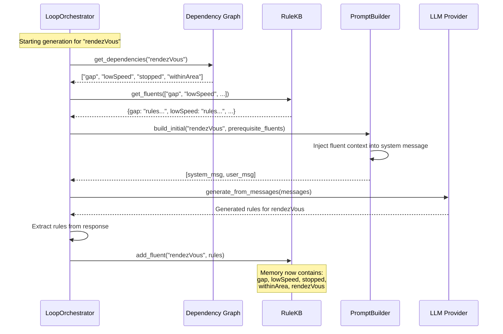
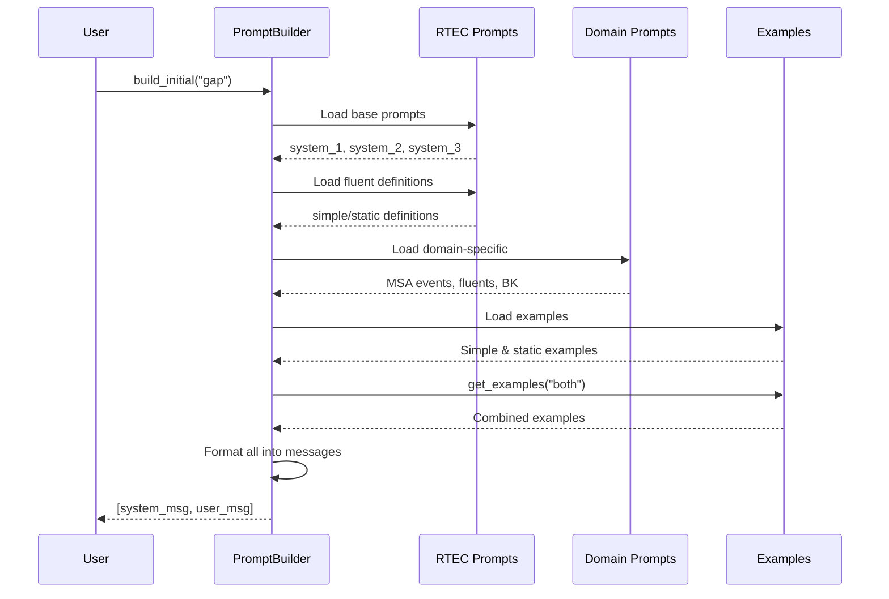
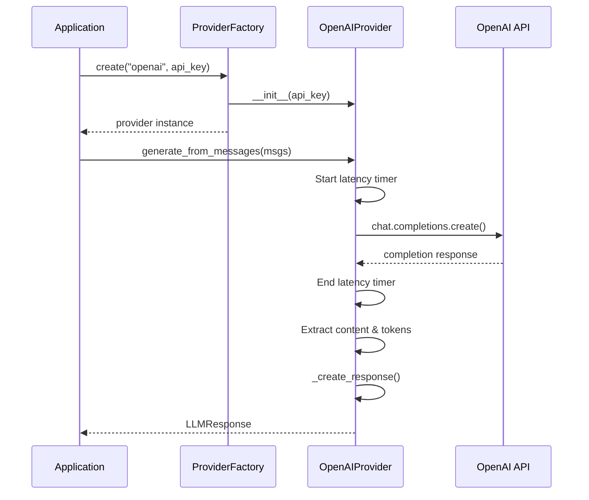
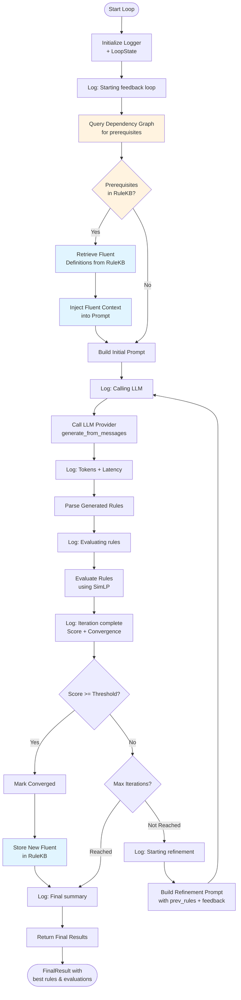

# Architecture Overview

This document describes the architecture of the feedback loop system for iterative RTEC rule generation.

## Key Components

1. **Memory Module (RuleKB)**: External memory system for storing and retrieving learned fluents
2. **Dependency Graph**: Static mapping of prerequisite fluents for each activity
3. **LoopOrchestrator**: Main controller implementing the feedback loop algorithm with memory integration
4. **Prompt Builders**: Domain-specific prompt construction with context injection (MSA, HAR)
5. **LLM Providers**: Abstraction layer for LLM APIs (OpenAI, etc.)
6. **SimLP Client**: Rule evaluation and feedback generation
7. **Logging System**: Comprehensive logging with file output
8. **Data Models**: Pydantic models for type safety and validation

> 📖 **For detailed Memory Module architecture**, see [docs/MEMORY_MODULE.md](./docs/MEMORY_MODULE.md)

# Component Interactions

## 0. **Memory Module Integration**



## 1. **Prompt Building Pipeline**



## 2. **LLM Provider Flow**



## 3. **Feedback Loop Cycle (with Memory Module)**



**Usage Examples:**
```python
# Verbose logging with file output
orchestrator = LoopOrchestrator(
    ...,
    verbose=True,
    log_dir="./logs"
)

# Custom log file
orchestrator = LoopOrchestrator(
    ...,
    log_file="./experiments/run_001.log"
)

# Custom logger
from src.loop.logging_config import setup_orchestrator_logging
logger = setup_orchestrator_logging(verbose=True)
orchestrator = LoopOrchestrator(..., logger=logger)
```

## 5. **Orchestrator Algorithm**

The `LoopOrchestrator` implements Algorithm 1 from the thesis:

```python
def run(domain: str, activity: str) -> FinalResult:
    """
    Algorithm Implementation:
    1. Generate initial rules using prompt builder + LLM
    2. Evaluate rules using SimLP
    3. While not converged and iterations < max:
         a. Build refinement prompt with feedback
         b. Generate refined rules
         c. Evaluate refined rules
         d. Check convergence (score >= threshold)
    4. Return best rules and statistics
    """
```

**Key Methods:**

- `_generate_initial_rules(activity)`: Build prompt → LLM → Extract rules
- `_refine_rules(activity, rules, feedback, attempt)`: Refinement prompt → LLM → Extract
- `_evaluate_rules(domain, activity, rules)`: Call SimLP with feedback generation
- `_should_continue(iteration, eval, history)`: Check convergence criteria
- `_record_iteration(response, evaluation)`: Track state and metrics
- `_extract_rules_from_response(response)`: Parse Prolog rules from LLM output
- `_build_final_result(reason)`: Calculate statistics and identify best iteration

**Convergence Criteria:**
1. Similarity score >= threshold (configurable, default 0.9)
2. Maximum iterations reached (configurable, default 5)

**State Tracking:**
- Each iteration creates a `LoopState` with requests, responses, evaluations
- History preserved for analysis and debugging
- Best rules tracked across all iterations (not necessarily the last one)

**Statistics Calculated:**
- Total/average tokens used
- Total/average latency
- Improvement (final - initial score)
- Improvement rate (improvement / iterations)
- Best iteration number and score


## File Organization

```
feedback-loop/
├── src/
│   ├── core/
│   │   ├── models.py          # Pydantic models for all data structures
│   │   ├── rule_kb.py         # 🆕 Memory Module (RuleKB) implementation
│   │   └── dependencies.py    # 🆕 Dependency graph definitions
│   ├── prompts/
│   │   ├── builder.py         # Prompt builder classes (with context injection)
│   │   ├── rtec_base.py       # Core RTEC prompts
│   │   ├── msa_domain.py      # MSA domain knowledge
│   │   ├── msa_examples.py    # MSA examples
│   │   ├── msa_requests.py    # MSA activity descriptions
│   │   ├── har_domain.py      # HAR domain knowledge
│   │   ├── har_examples.py    # HAR examples
│   │   └── har_requests.py    # HAR activity descriptions
│   ├── llm/
│   │   ├── provider_base.py   # Abstract provider interface
│   │   ├── provider_openai.py # OpenAI implementation
│   │   └── factory.py         # Provider factory
│   ├── loop/
│   │   ├── orchestrator.py    # Feedback loop orchestration (with memory integration)
│   │   └── logging_config.py  # Logging configuration
│   ├── simlp/
│   │   └── client.py          # SimLP evaluation client
│   └── cli/
│       └── main.py            # Command-line interface
├── tests/
│   ├── test_models.py         # Core model tests
│   ├── test_prompts.py        # RTEC prompt tests
│   ├── test_loop_orchestrator.py # Orchestrator tests (27 tests)
│   ├── test_llm_provider.py   # Provider tests
│   ├── test_rule_kb.py        # 🆕 Memory Module tests
│   └── test_memory_integration.py # 🆕 End-to-end memory tests
├── notebooks/
│   └── feedback_loop_usage.ipynb # Tutorial notebook
├── docs/
│   ├── MEMORY_MODULE.md       # 🆕 Memory Module architecture and design
│   └── LOGGING_GUIDE.md       # Comprehensive logging guide
└── logs/                      # Auto-generated log files
```

**🆕 New Components for Memory Module:**
- `src/core/rule_kb.py`: RuleKB class for storing/retrieving learned fluents
- `src/core/dependencies.py`: Static dependency graphs (MSA_DEPENDENCIES, HAR_DEPENDENCIES)
- `docs/MEMORY_MODULE.md`: Complete design document and implementation guide
- `tests/test_rule_kb.py`: Unit tests for RuleKB operations
- `tests/test_memory_integration.py`: Integration tests for memory-enabled generation
