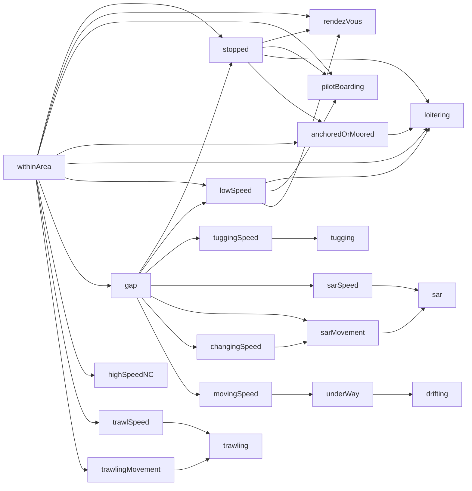
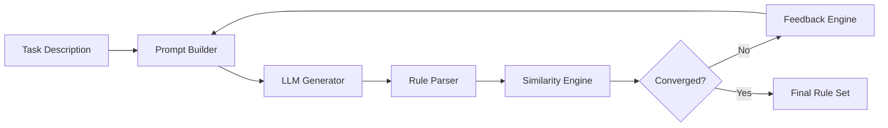

# Feedback Loop: Iterative Generation, Evaluation & Refinement of Logic-Based Rule Systems

This repository provides a framework for the structured generation, evaluation, and refinement of logic-based rule systems using LLMs.
It operationalizes the methodology described in the MSc thesis:

### 📚 Supporting MSc Thesis

> Applications of Large Language Models in Event Calculus
>
> A Comprehensive Study on the RTEC Framework
> 
>Georgios Panagopoulos, University of the Peloponnese & NCSR “Demokritos”, 2025

### 🖌 Problem Statement

Complex Event Recognition (CER) systems such as RTEC rely on declarative event descriptions—logical rules that specify how complex events arise from lower-level signals.

However, as described in the thesis background , manually constructing such rules is:
technically demanding, requiring expertise in logic programming and temporal reasoning.

#### 🔹 Hierarchical structure
Error-proneness becomes particularly acute in hierarchically structured, multi-fluent event descriptions, where higher-level activities depend on chains of lower-level fluents and behavioural patterns. In domains such as Maritime Situational Awareness (MSA), even a single complex event may rely on an interconnected network of speed-related, movement-related, and spatial fluents. This produces dependency structures such as the one below, where a base condition like withinArea propagates through multiple layers of derived fluents—eventually culminating in composite activities such as loitering, rendezVous, tugging, trawling, or SAR operations.
Such hierarchies introduce ample opportunity for logical omissions, incorrect chaining, or inconsistencies in argument structure, especially when authored manually by non-experts:

#### 🔹 Scalability
Beyond correctness concerns, this hierarchical complexity also poses issues of scalability: operational CER deployments may involve dozens of such fluents, with dependencies that span multiple levels of abstraction. As the number of rules grows, so does the difficulty of ensuring internal consistency, completeness, and semantic fidelity.
#### 🔹 Business (Non-technical) experts
Finally, the construction of these rules is not accessible to most domain experts—for instance maritime analysts or transportation engineers—who understand the operational behaviours but typically lack proficiency in Prolog-style declarative programming. This disconnect between domain expertise and formal specification languages motivates the need for automated, LLM-assisted generation and verification mechanisms.

Meanwhile, LLMs can generate code and symbolic structures, but their reasoning is:
 - structurally inconsistent, especially for hierarchical compositions.
 - semantically fragile, often producing syntactically valid but logically incorrect rules.

Therefore, the central research problem is:
> How can we design a systematic, verifiable, and iterative mechanism that
> enables LLMs to generate correct, RTEC-compatible event descriptions from
> natural language—despite the inherent reasoning limitations of current
> models?

### ✨ Key Features
## ✨ Features

- Multi-provider LLM interface 
- Automated feedback loop for iterative refinement
- Pluggable parser for logic-based languages (Prolog-style by default)

- Detailed rule-level feedback generation
- Experiment orchestration and logging
- Clean modular architecture

## 🧩 Architecture Overview (without memory)

## 🧩 Architecture Overview (added memory)
Regarding the architecture you can refer to [Architecture](./docs/ARCHITECTURE.md)

