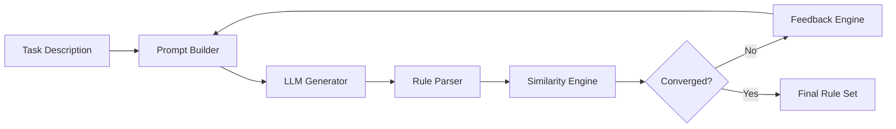

# Feedback Loop: Iterative Generation, Evaluation & Refinement of Logic-Based Rule Systems

### Overview
This repository provides a framework for the structured generation, evaluation, and refinement of logic-based rule systems using LLMs.
It operationalizes the methodology described in the MSc thesis:

### 📚 Supporting MSc Thesis

> Applications of Large Language Models in Event Calculus
>
> A Comprehensive Study on the RTEC Framework
> 
>Georgios Panagopoulos, University of the Peloponnese & NCSR “Demokritos”, 2025

The framework supports:
- Multi-provider LLM interface 
- Automated feedback loop for iterative refinement
- Pluggable parser for logic-based languages (Prolog-style by default)

- Detailed rule-level feedback generation
- Experiment orchestration and logging
- Clean modular architecture

### Motivation & Research Problem
Complex Event Recognition (CER) systems such as RTEC rely on declarative rule descriptions to infer high-level activities from low-level signals. Constructing these rule sets is:

 - Technically demanding — requiring expertise in logic programming and temporal reasoning.
 - Hierarchical — high-level activity definitions depend on chains of prerequisite fluents. refer here for more: [Hierarchical fluent structure](./docs/fluent-hierarchy.md)
 - Error-prone — small omissions or inconsistencies propagate across the hierarchy.
 - Not accessible to domain experts who understand the domain but not Prolog-style languages.

Meanwhile, LLMs are capable of generating symbolic structures, but:
 - They are stateless and forget previously generated rule definitions.
 - They struggle with multi-step logical reasoning and hierarchical constraints.
 - They produce syntactically valid but logically incorrect rules without external validation.
#### Central Research Question
> How can we design a systematic, verifiable, and iterative mechanism that enables LLMs to generate correct, RTEC-compatible event descriptions despite their reasoning limitations?

This repository provides an engineered answer to that question.
### Key Contributions (from the MSc Thesis)
This implementation contributes:
#### 1. A feedback-driven rule synthesis loop
Integrates generation → evaluation → refinement cycles until similarity converges.
#### 2. A memory module enabling hierarchical prompting
Stores validated fluent definitions and injects them into future prompts.

### System architecture
The system follows a structured pipeline:

A more detailed technical description is provided in: [Architecture](./docs/ARCHITECTURE.md)

Instructions on how to setup and run can be found here: [Instructions](./docs/setup.md)
