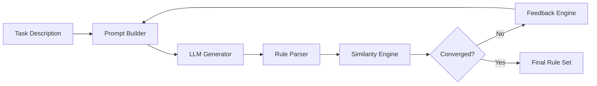

# Feedback Loop: Iterative Generation, Evaluation & Refinement of Logic-Based Rule Systems

[](https://www.python.org/downloads/)
[](https://opensource.org/licenses/MIT)
[](https://github.com/psf/black)


A modular framework for LLM-driven generation, evaluation, and refinement of logic-based rule systems.  
It implements an automated feedback loop that analyzes generated rules, compares them to reference definitions, and produces structured feedback for iterative improvement.

### 📚 Supporting MSc Thesis

> **Applications of Large Language Models in Event Calculus – A comprehensive study on the RTEC framework**  
> *Georgios Panagopoulos, 2025*

## ✨ Features

- Multi-provider LLM interface 
- Automated feedback loop for iterative refinement
- Pluggable parser for logic-based languages (Prolog-style by default)

- Detailed rule-level feedback generation
- Experiment orchestration and logging
- Clean modular architecture

## 🧩 Architecture Overview (without memory)


## 🧩 Architecture Overview (added memory)
Regarding the architecture you can refer to [Architecture](ARCHITECTURE.md)
## 🚀 Quick Start

### Installation

If you do not already have uv package manager, i suggest you install it!
uv is a modern, ultra-fast Python package manager by Astral

```bash
curl -LsSf https://astral.sh/uv/install.sh | sh
```

```bash
# Clone the repository
git clone https://github.com/PanagopoulosGeorge/thesis-ds.git
cd thesis-ds

# Create virtual environment
uv venv
source .venv/bin/activate  # On Windows: .venv\Scripts\activate

# Install dependencies (includes simLP automatically)
pip install -e .  # Basic installation
```

**Note**: The framework automatically installs [simLP](https://github.com/PanagopoulosGeorge/simLP) for RTEC parsing, similarity computation, and automated feedback generation.