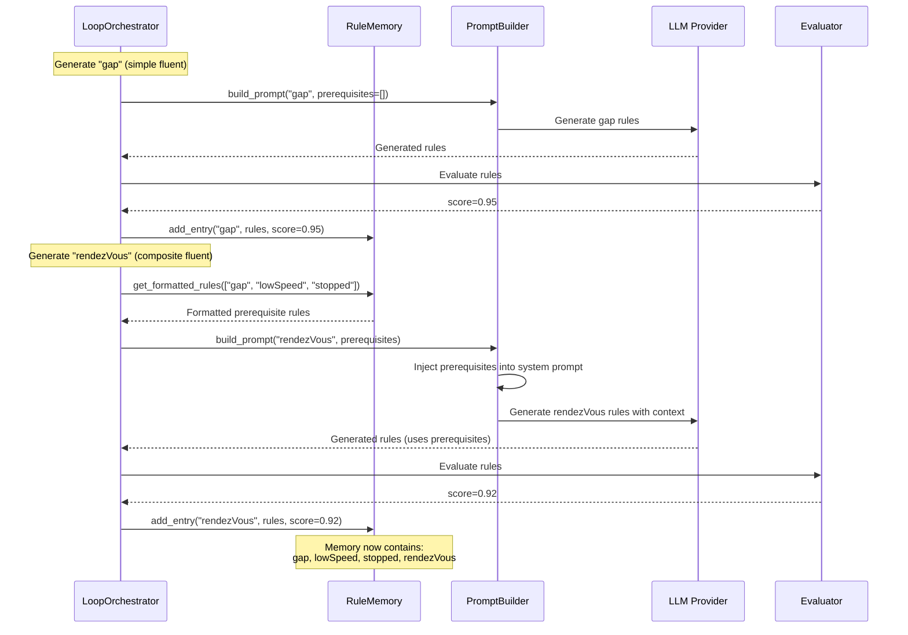

# Architecture Overview

This document describes the architecture of the feedback loop system for iterative RTEC rule generation.

## Key Components

1. **Memory Module (RuleKB)**: External memory system for storing and retrieving learned fluents
3. **LoopOrchestrator**: Main controller implementing the feedback loop algorithm with memory integration
4. **Prompt Builders**: Domain-specific prompt construction with context injection (MSA, HAR)
5. **LLM Providers**: Abstraction layer for LLM APIs (OpenAI, etc.)
6. **SimLP Client**: Rule evaluation and feedback generation
7. **Logging System**: Comprehensive logging with file output
8. **Data Models**: Pydantic models for type safety and validation


# Rule Memory Module Documentation

## Overview

The **RuleMemory** module (`src/core/rule_memory.py`) provides a persistent key-value store for RTEC fluent rules. It serves as the memory system for the stateless LLM, storing previously learned fluent definitions that can be retrieved and injected into future prompts.

### Purpose

In an LLM-based RTEC rule generation system:
- **LLMs are stateless** — They don't remember previous interactions
- **RTEC activities are hierarchical** — Composite fluents depend on simpler ones
- **Context is critical** — The LLM needs access to prerequisite fluent definitions

RuleMemory solves this by providing **external memory** that persists across LLM calls.
# Component Interactions



## 5. **Orchestrator Algorithm**

The `LoopOrchestrator` implements Algorithm 1 from the thesis:

```python
    """
    Algorithm Implementation:
    1. Generate initial rules using prompt builder + LLM
    2. Evaluate rules using SimLP
    3. While not converged and iterations < max:
         a. Build refinement prompt with feedback
         b. Generate refined rules
         c. Evaluate refined rules
         d. Check convergence (score >= threshold)
    4. Return best rules and statistics
    """
```

**Convergence Criteria:**
1. Similarity score >= threshold (configurable, default 0.9)
2. Maximum iterations reached (configurable, default 5)