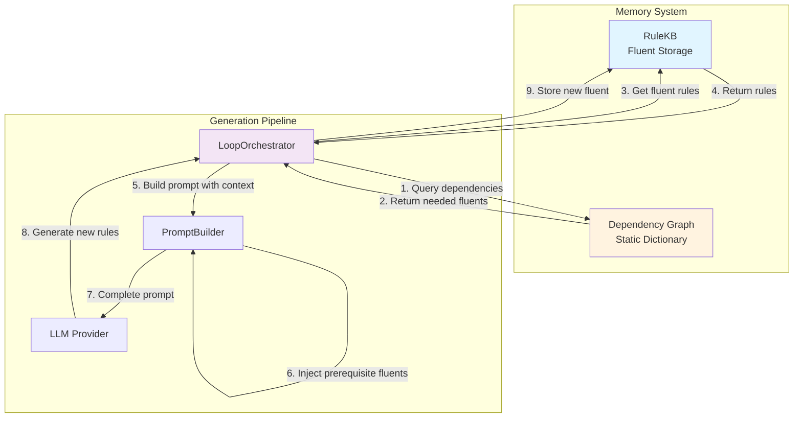

# Memory Module Architecture: Rule Knowledge Base (RuleKB)

## Problem Statement

The LLM-based RTEC rule generation system faces a fundamental challenge:

- **LLMs are stateless** — They forget everything after each API call
- **RTEC composite activities are hierarchical** — Later activities depend on fluents defined earlier
- **Dependency chains exist** — `lowSpeed` → `stopped` → `gap` → `rendezVous`

Without a memory mechanism, the LLM cannot generate correct composite activities that reference previously learned fluents.

## Solution: Memory Module

We introduce a **Memory Module** that acts as external memory for the stateless LLM, storing previously learned fluents and injecting them into prompts when needed.

### 🎯 Core Concept

> "Give the LLM memory by explicitly injecting previously learned knowledge into the prompt context."

---

## 1️⃣ The Memory Module: RuleKB

The `RuleKB` (Rule Knowledge Base) is a simple storage module with one responsibility:

**Store and retrieve previously learned RTEC fluents.**

Structure

```python
class RuleKB:
    """
    Minimal Knowledge Base for storing learned RTEC fluents.
    """
    def __init__(self):
        self.store: Dict[str, str] = {}
        # Example:
        # {
        #     "withinArea": "<holdsFor(withinArea(V)=true, I) :- ...>",
        #     "stopped": "<holdsFor(stopped(V)=true, I) :- ...>",
        #     "lowSpeed": "<holdsFor(lowSpeed(V)=true, I) :- ...>",
        # }
    
    def add_fluent(self, fluent_name: str, rules: str):
        """Store rules for a learned fluent."""
        self.store[fluent_name] = rules
    
    def get_fluent(self, fluent_name: str) -> Optional[str]:
        """Retrieve rules for a specific fluent."""
        return self.store.get(fluent_name)
    
    def get_fluents(self, fluent_names: List[str]) -> Dict[str, str]:
        """Retrieve multiple fluents at once."""
        return {name: self.store[name] 
                for name in fluent_names 
                if name in self.store}
    
    def has_fluent(self, fluent_name: str) -> bool:
        """Check if a fluent exists in memory."""
        return fluent_name in self.store
    
    def list_fluents(self) -> List[str]:
        """List all stored fluent names."""
        return list(self.store.keys())
```

### Key Properties

✅ **Simple** — Just a dictionary mapping fluent names to rule strings  
✅ **Stateful** — Persists across multiple LLM calls  
✅ **Queryable** — Can retrieve specific fluents on demand  
✅ **Extensible** — Easy to replace with a vector DB or graph database later  

---

## 2️⃣ The Dependency Graph

The dependency graph defines **which fluents each activity needs**.

### MVP Implementation: Static Dictionary

```python
# Dependency graph for MSA activities
MSA_DEPENDENCIES = {
    # Simple fluents (no dependencies)
    "withinArea": [],
    "gap": [],
    "stopped": [],
    "lowSpeed": [],
    "changingSpeed": [],
    "highSpeedNearCoast": [],
    "movingSpeed": [],
    "drifting": [],
    "trawlSpeed": [],
    "trawling": [],
    "anchoredOrMoored": [],
    "tugging": [],
    
    # Composite fluents (have dependencies)
    "rendezVous": ["gap", "lowSpeed", "stopped", "withinArea"],
    "loitering": ["stopped", "lowSpeed", "anchoredOrMoored"],
    "pilotBoarding": ["rendezVous", "withinArea", "lowSpeed"],
    "tuggingSpeed": ["tugging", "trawlSpeed"],
    "inSAR": ["stopped"],
    # ... more activities
}

# Dependency graph for HAR activities
HAR_DEPENDENCIES = {
    "walking": [],
    "running": [],
    "sitting": [],
    "standing": [],
    # ... more activities
}
```

### Why This Works

- **Declarative** — Explicitly states "Activity X needs Fluents A, B, C"
- **Deterministic** — No guessing or inference needed
- **Easy to Maintain** — All dependencies in one place
- **Ground Truth** — Derived from domain analysis (thesis work)

---

## 3️⃣ Memory Module + Dependency Graph Integration

### Workflow: Before Generating Rules

When the `LoopOrchestrator` starts generating rules for an activity:

```python
def run(self, domain: str, activity: str) -> FinalResult:
    # 1. Get dependencies for this activity
    dependencies = DEPENDENCY_GRAPH[domain][activity]
    
    # 2. Check what fluents we already have in memory
    needed_fluents = self.rule_kb.get_fluents(dependencies)
    
    # 3. Inject them into the prompt
    messages = self.prompt_builder.build_initial(
        activity=activity,
        prerequisite_fluents=needed_fluents  # ← New parameter
    )
    
    # 4. Generate rules with full context
    response = self.llm_provider.generate(messages)
    
    # 5. Extract and store the new fluent
    rules = self._extract_rules_from_response(response)
    self.rule_kb.add_fluent(activity, rules)
    
    return result
```

### Key Insight

> The LLM doesn't need memory — the system provides it through the prompt.

---

## 4️⃣ Injecting Knowledge Into the Prompt

The `PromptBuilder` receives prerequisite fluents and includes them in the system message:

### Before (Without Memory Module)

```python
System:
    "You are an RTEC expert. Generate rules for 'rendezVous'."

User:
    "Generate rules for the rendezVous activity."
```

❌ **Problem:** LLM doesn't know what `gap`, `lowSpeed`, `stopped`, `withinArea` mean.

### After (With Memory Module)

```python
System:
    "You are an RTEC expert. Generate rules for 'rendezVous'.
    
    Here are previously learned RTEC fluents you MUST use:
    
    === Fluent: gap ===
    holdsFor(gap(V1,V2)=nearPorts, I) :-
        ...
    
    === Fluent: lowSpeed ===
    holdsFor(lowSpeed(V)=true, I) :-
        ...
    
    === Fluent: stopped ===
    holdsFor(stopped(V)=farFromPorts, I) :-
        ...
    
    === Fluent: withinArea ===
    holdsFor(withinArea(V,AreaType)=true, I) :-
        ..."

User:
    "Generate rules for rendezVous using the fluents provided above."
```

✅ **Solution:** LLM has full context of all required fluents.

---

## 5️⃣ Architecture Diagram



---

## 6️⃣ Benefits of This Design

| Aspect | Without Memory Module | With Memory Module |
|--------|----------------------|-------------------|
| **Hierarchy Support** | ❌ Cannot generate composite activities | ✅ Full hierarchical support |
| **LLM Context** | ❌ Missing prerequisite definitions | ✅ Complete context in prompt |
| **Determinism** | ❌ LLM must guess fluent meanings | ✅ Explicit knowledge injection |
| **Debugging** | ❌ Hard to trace missing context | ✅ Easy to see what was injected |
| **Extensibility** | ❌ Limited to single activities | ✅ Can chain unlimited dependencies |
| **Statelessness** | ❌ System forgets everything | ✅ External memory persists |

---

## 7️⃣ Implementation Plan

### Phase 1: Core Components (MVP)

1. **Create `RuleKB` class** (`src/core/rule_kb.py`)
   - Simple dictionary-based storage
   - CRUD operations for fluents
   
2. **Define Dependency Graphs** (`src/core/dependencies.py`)
   - Static dictionaries for MSA and HAR
   - Document dependency sources
   
3. **Integrate with LoopOrchestrator** (`src/loop/orchestrator.py`)
   - Add `RuleKB` instance
   - Query dependencies before generation
   - Store results after generation

4. **Update PromptBuilder** (`src/prompts/builder.py`)
   - Add `prerequisite_fluents` parameter
   - Inject fluents into system message
   - Format fluents clearly

### Phase 2: Testing & Validation

5. **Unit Tests** (`tests/test_rule_kb.py`)
   - Test storage and retrieval
   - Test dependency resolution
   - Test prompt injection

6. **Integration Tests** (`tests/test_memory_integration.py`)
   - Test end-to-end with dependencies
   - Verify correct fluents are injected
   - Validate generated rules use prerequisites

### Phase 3: Advanced Features (Post-MVP)

7. **Persistence** (optional)
   - Save `RuleKB` to disk (JSON/SQLite)
   - Load previous sessions
   
8. **Dependency Graph Visualization** (optional)
   - Generate DOT/Graphviz diagrams
   - Show hierarchy and connections
   
9. **Alternative Storage Backends** (future)
   - Vector database (RAG approach)
   - Neo4j graph database
   - Hybrid: RuleKB + vector similarity search

---

## 8️⃣ Usage Example

```python
from src.loop.orchestrator import LoopOrchestrator
from src.core.rule_kb import RuleKB
from src.core.dependencies import MSA_DEPENDENCIES

# Initialize with memory
rule_kb = RuleKB()
orchestrator = LoopOrchestrator(
    llm_provider=provider,
    rule_kb=rule_kb,
    dependency_graph=MSA_DEPENDENCIES
)

# Generate simple fluents first (no dependencies)
orchestrator.run(domain="MSA", activity="gap")
orchestrator.run(domain="MSA", activity="lowSpeed")
orchestrator.run(domain="MSA", activity="stopped")
orchestrator.run(domain="MSA", activity="withinArea")

# Now generate composite activity (has dependencies)
# Automatically retrieves and injects gap, lowSpeed, stopped, withinArea
result = orchestrator.run(domain="MSA", activity="rendezVous")

print(f"Memory contains: {rule_kb.list_fluents()}")
# Output: ['gap', 'lowSpeed', 'stopped', 'withinArea', 'rendezVous']
```

---

## 9️⃣ Summary (For Thesis Documentation)

> **Memory Module for Hierarchical RTEC Rule Generation**
>
> We introduce a **Memory Module** (`RuleKB`) that addresses the statelessness of LLM APIs when generating hierarchical RTEC composite activities.
>
> The module stores previously learned fluent definitions and uses a **dependency graph** to determine which fluents each activity requires. Before generating rules, the system queries the memory module and **injects the necessary prerequisite fluents** into the prompt context.
>
> This explicit knowledge injection gives the LLM access to hierarchical dependencies without requiring the API to maintain state between calls. The approach is:
> - ✅ **Deterministic** — All context is explicitly provided
> - ✅ **Transparent** — Easy to debug and trace knowledge flow  
> - ✅ **Extensible** — Can be enhanced with RAG, vector DBs, or graph databases
> - ✅ **Minimal** — Adds only essential complexity for MVP
>
> The Memory Module enables full support for composite activities while maintaining the simplicity and modularity of the feedback loop architecture.

---

## 🔟 Future Enhancements

### RAG-Based Memory (Retrieval-Augmented Generation)
- Use vector embeddings to find relevant fluents
- Retrieve based on semantic similarity
- Useful when dependency graph is incomplete

### Graph-Based Memory (Neo4j)
- Store fluents as nodes
- Dependencies as edges
- Query with Cypher: "Find all transitive dependencies"

### Hybrid Memory
- Static dependencies for known relations
- Vector search for discovering new relations
- Best of both worlds

### Learning Dependency Graph
- Automatically extract dependencies from generated rules
- Build graph dynamically during execution
- Reduce manual maintenance

---

## Related Documentation

- [ARCHITECTURE.md](../ARCHITECTURE.md) — Overall system architecture
- [README.md](../README.md) — Quick start and usage
- [LOGGING_GUIDE.md](./LOGGING_GUIDE.md) — Logging and debugging

---

**Status:** 📋 Design Document (Implementation Pending)  
**Version:** 1.0 MVP  
**Last Updated:** November 27, 2025
