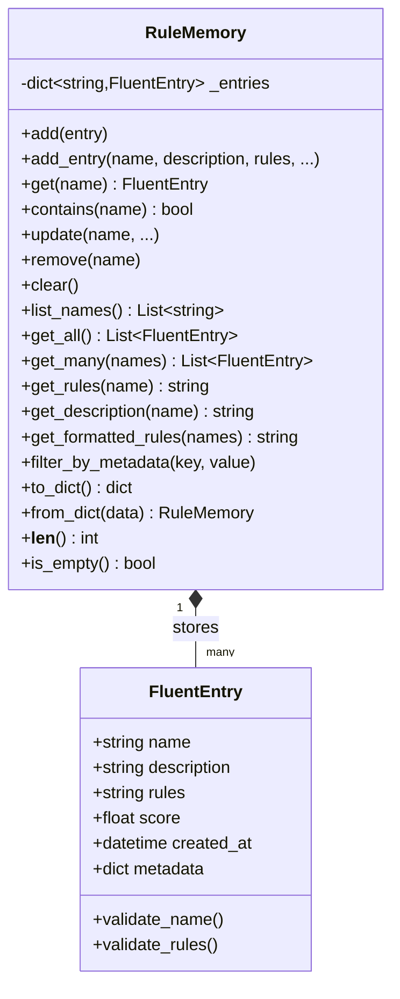

# Rule Memory Module Documentation

## Overview

The **RuleMemory** module (`src/core/rule_memory.py`) provides a persistent key-value store for RTEC fluent rules. It serves as the memory system for the stateless LLM, storing previously learned fluent definitions that can be retrieved and injected into future prompts.

### Purpose

In an LLM-based RTEC rule generation system:
- **LLMs are stateless** — They don't remember previous interactions
- **RTEC activities are hierarchical** — Composite fluents depend on simpler ones
- **Context is critical** — The LLM needs access to prerequisite fluent definitions

RuleMemory solves this by providing **external memory** that persists across LLM calls.

---
### Data Model
---


---

## Core Components

### 1. FluentEntry

A **Pydantic model** representing a single fluent's rules and metadata.

#### Fields

| Field | Type | Required | Description |
|-------|------|----------|-------------|
| `name` | `str` | ✅ Yes | Unique fluent identifier (e.g., `"gap"`, `"lowSpeed"`) |
| `description` | `str` | No | Natural language description of the fluent |
| `rules` | `str` | ✅ Yes | RTEC Event Calculus rules (Prolog-style) |
| `score` | `float` | No | Evaluation score (0.0 - 1.0) from validation |
| `created_at` | `datetime` | Auto | Timestamp when entry was created |
| `metadata` | `dict` | No | Extensible metadata (dependencies, domain, etc.) |

#### Validation

- **Name**: Cannot be empty or whitespace
- **Rules**: Cannot be empty or whitespace
- **Score**: Must be between 0.0 and 1.0 if provided
- **Description**: Can be empty (useful for imported rules)

#### Example

```python
from src.core.rule_memory import FluentEntry

entry = FluentEntry(
    name="gap",
    description="Communication gap between two vessels",
    rules="""
    initiatedAt(gap(Vessel1, Vessel2)=nearPorts, T) :-
        happensAt(gap_start(Vessel1, Vessel2), T),
        holdsAt(withinArea(Vessel1, nearPorts)=true, T).
    """,
    score=0.95,
    metadata={
        "domain": "MSA",
        "fluent_type": "simple",
        "dependencies": []
    }
)
```

---

## Usage Patterns

### Basic CRUD Operations

#### Create / Add

```python
from src.core.rule_memory import RuleMemory

memory = RuleMemory()

# Method 1: Add FluentEntry object
from src.core.rule_memory import FluentEntry

entry = FluentEntry(
    name="gap",
    description="Communication gap activity",
    rules="initiatedAt(gap(V1,V2)=nearPorts, T):- ..."
)
memory.add(entry)

# Method 2: Add using keyword arguments (simpler)
memory.add_entry(
    name="lowSpeed",
    description="Low speed activity",
    rules="initiatedAt(lowSpeed(V)=true, T):- ...",
    score=0.95
)
```

#### Read / Retrieve

```python
# Get full entry
entry = memory.get("gap")
if entry:
    print(entry.name)
    print(entry.rules)
    print(entry.score)

# Check existence
if memory.contains("gap"):
    print("Gap fluent exists!")

# Get just the rules (common case)
rules = memory.get_rules("gap")

# Get just the description
description = memory.get_description("gap")

# List all fluent names
names = memory.list_names()
print(f"Learned fluents: {names}")
# Output: ['gap', 'lowSpeed', 'stopped', 'withinArea']

# Get all entries
all_entries = memory.get_all()

# Get multiple entries by name
entries = memory.get_many(["gap", "lowSpeed", "stopped"])
```

#### Update

```python
# Update specific fields
memory.update(
    name="gap",
    rules="<new improved rules>",
    score=0.98
)

# Description and metadata remain unchanged
```

#### Delete

```python
# Remove an entry
removed_entry = memory.remove("gap")

# Clear all entries
memory.clear()
```

---

### Prompt Injection (Primary Use Case)

The main purpose of RuleMemory is to **inject prerequisite fluent definitions into LLM prompts**.

```python
memory = RuleMemory()

# Orchestrator stores learned fluents
memory.add_entry(
    name="gap",
    description="Communication gap between vessels",
    rules="initiatedAt(gap(V1,V2)=nearPorts, T):- ..."
)
memory.add_entry(
    name="lowSpeed",
    description="Vessel moving at low speed",
    rules="initiatedAt(lowSpeed(V)=true, T):- ..."
)
memory.add_entry(
    name="stopped",
    description="Vessel has stopped moving",
    rules="initiatedAt(stopped(V)=farFromPorts, T):- ..."
)

# PromptBuilder retrieves formatted rules for prompt injection
prerequisites = ["gap", "lowSpeed", "stopped"]
formatted = memory.get_formatted_rules(
    names=prerequisites,
    include_description=True
)

print(formatted)
```

**Output:**
```prolog
% === gap ===
% Description: Communication gap between vessels
initiatedAt(gap(V1,V2)=nearPorts, T):- ...

% === lowSpeed ===
% Description: Vessel moving at low speed
initiatedAt(lowSpeed(V)=true, T):- ...

% === stopped ===
% Description: Vessel has stopped moving
initiatedAt(stopped(V)=farFromPorts, T):- ...
```

This formatted string is then injected into the system prompt:

```python
system_prompt = f"""
You are an RTEC expert. Generate rules for the 'rendezVous' activity.

Here are previously learned fluents you MUST use:

{formatted}

Now generate the rendezVous rules using the fluents above.
"""
```

## Extensibility Features

### Metadata Support

The `metadata` field enables future extensions without breaking the API:

```python
memory.add_entry(
    name="rendezVous",
    description="Two vessels meet at sea",
    rules="holdsFor(rendezVous(V1,V2)=true, I):- ...",
    metadata={
        "domain": "MSA",
        "fluent_type": "composite",
        "dependencies": ["gap", "lowSpeed", "stopped", "withinArea"],
        "complexity": "high",
        "evaluation_method": "simLP"
    }
)

# Filter by metadata
composite_fluents = memory.filter_by_metadata("fluent_type", "composite")
msa_fluents = memory.filter_by_metadata("domain", "MSA")
```

### Serialization / Persistence

Save and load memory to/from disk:

```python
import json

# Export to dictionary
data = memory.to_dict()

# Save to file
with open("rule_memory_state.json", "w") as f:
    json.dump(data, f, indent=2)

# Load from file
with open("rule_memory_state.json", "r") as f:
    loaded_data = json.load(f)

# Restore memory
memory = RuleMemory.from_dict(loaded_data)
```

**Saved format:**
```json
{
  "gap": {
    "description": "Communication gap between vessels",
    "rules": "initiatedAt(gap(V1,V2)=nearPorts, T):- ...",
    "score": 0.95,
    "created_at": "2025-11-27T10:30:00.123456",
    "metadata": {
      "domain": "MSA",
      "fluent_type": "simple"
    }
  },
  "lowSpeed": {
    "description": "Vessel moving at low speed",
    "rules": "initiatedAt(lowSpeed(V)=true, T):- ...",
    "score": 0.98,
    "created_at": "2025-11-27T10:31:00.123456",
    "metadata": {
      "domain": "MSA",
      "fluent_type": "simple"
    }
  }
}
```

---

## Testing

The module has **comprehensive test coverage** (`tests/test_rule_memory.py`):

### Test Categories

| Category | Tests | Coverage |
|----------|-------|----------|
| **FluentEntry Model** | 8 tests | Validation, timestamps, metadata |
| **Basic CRUD** | 12 tests | Add, get, update, remove, clear |
| **Retrieval Methods** | 5 tests | Specialized getters, formatting |
| **Serialization** | 3 tests | Export/import, persistence |
| **Extensibility** | 3 tests | Metadata filtering, batch operations |

### Running Tests

```bash
# Run all rule_memory tests
pytest tests/test_rule_memory.py -v

# Run specific test class
pytest tests/test_rule_memory.py::TestRuleMemoryRetrieval -v

# Run with coverage
pytest tests/test_rule_memory.py --cov=src.core.rule_memory --cov-report=html
```

---

## Design Decisions

### Why Dictionary Over Database?

No need.

| Aspect | In-Memory Dict | Database | Vector DB |
|--------|----------------|----------|-----------|
| **Setup** | Zero config | Schema setup | Index creation |
| **Performance** | Instant | Query overhead | Embedding overhead |
| **Persistence** | JSON export | Native | Native |
| **Query Power** | Basic | SQL | Semantic search |
| **MVP Ready** | ✅ Yes | ⚠️ Overkill | ⚠️ Future feature |

**Migration Path**: The interface supports future backends without API changes.

### Why Pydantic for FluentEntry?

- ✅ **Validation**: Automatic field validation
- ✅ **Type Safety**: IDE autocomplete and type checking
- ✅ **Serialization**: Built-in JSON export/import
- ✅ **Documentation**: Self-documenting with field descriptions
- ✅ **Extensibility**: Easy to add new fields

### Why Separate Description and Rules?

- **Description**: Human-readable explanation (for logging, debugging)
- **Rules**: Machine-executable RTEC code (for injection, evaluation)
- **Flexibility**: Can import rules without descriptions, or vice versa

---

## Future Enhancements

### 1. Dependency Graph Integration

Currently, dependencies are stored in metadata but not automatically resolved:

```python
# Future API
memory.add_entry(
    name="rendezVous",
    rules="...",
    dependencies=["gap", "lowSpeed", "stopped"]  # Explicit parameter
)

# Automatic transitive dependency resolution
all_prerequisites = memory.get_dependencies_recursive("rendezVous")
# Returns: ["gap", "lowSpeed", "stopped", "withinArea", ...]
```

### 2. Version Control

Track rule evolution across iterations:

```python
entry = memory.get_with_history("gap")
print(f"Current version: {entry.version}")
print(f"Previous versions: {entry.history}")
```

### 3. Semantic Search

Use embeddings to find similar fluents:

```python
similar = memory.find_similar(
    query="vessel communication activity",
    top_k=3
)
# Returns: [("gap", 0.95), ("proximity", 0.87), ("communication", 0.82)]
```

### 4. Rule Validation

Integrate with RTEC compiler:

```python
memory.add_entry(
    name="gap",
    rules="<potentially invalid rules>",
    validate=True  # Checks syntax before storing
)
```

### 5. Multi-Domain Support

Namespace fluents by domain:

```python
memory.add_entry(
    name="gap",
    rules="...",
    domain="MSA"
)

msa_fluents = memory.list_names(domain="MSA")
har_fluents = memory.list_names(domain="HAR")
```

---

## Related Documentation

- 📖 [Memory Module Architecture](./MEMORY_MODULE.md) — High-level design and motivation
- 📖 [Architecture Overview](../ARCHITECTURE.md) — System architecture
- 📖 [README](../README.md) — Quick start and usage examples

---

## API Reference

### RuleMemory

#### Constructor

```python
memory = RuleMemory()
```

#### Core Methods

| Method | Parameters | Returns | Description |
|--------|-----------|---------|-------------|
| `add(entry)` | `entry: FluentEntry` | `None` | Add a FluentEntry to memory |
| `add_entry(...)` | `name, description, rules, score, metadata` | `FluentEntry` | Add entry with kwargs |
| `get(name)` | `name: str` | `Optional[FluentEntry]` | Get entry by name |
| `contains(name)` | `name: str` | `bool` | Check if fluent exists |
| `update(...)` | `name, description, rules, score, metadata` | `FluentEntry` | Update existing entry |
| `remove(name)` | `name: str` | `FluentEntry` | Remove and return entry |
| `clear()` | — | `None` | Remove all entries |
| `list_names()` | — | `List[str]` | Get all fluent names |
| `get_all()` | — | `List[FluentEntry]` | Get all entries |
| `get_many(names)` | `names: List[str]` | `List[FluentEntry]` | Get multiple entries |

#### Specialized Retrieval

| Method | Parameters | Returns | Description |
|--------|-----------|---------|-------------|
| `get_rules(name)` | `name: str` | `Optional[str]` | Get just the rules |
| `get_description(name)` | `name: str` | `Optional[str]` | Get just the description |
| `get_formatted_rules(...)` | `names: List[str], include_description: bool` | `str` | Format rules for prompt injection |

#### Filtering & Querying

| Method | Parameters | Returns | Description |
|--------|-----------|---------|-------------|
| `filter_by_metadata(...)` | `key: str, value: Any` | `List[FluentEntry]` | Filter by metadata field |

#### Serialization

| Method | Parameters | Returns | Description |
|--------|-----------|---------|-------------|
| `to_dict()` | — | `Dict[str, Dict]` | Export to dictionary |
| `from_dict(data)` | `data: Dict[str, Dict]` | `RuleMemory` | Create from dictionary (class method) |

#### Utility

| Method | Returns | Description |
|--------|---------|-------------|
| `__len__()` | `int` | Number of entries |
| `is_empty()` | `bool` | Check if memory is empty |

---

**Status:** ✅ Implemented and Tested  
**Version:** 1.0  
**Last Updated:** November 27, 2025
