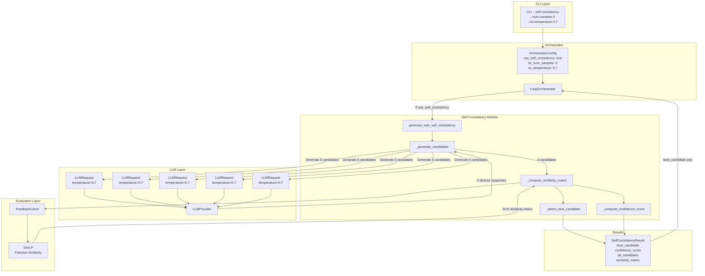
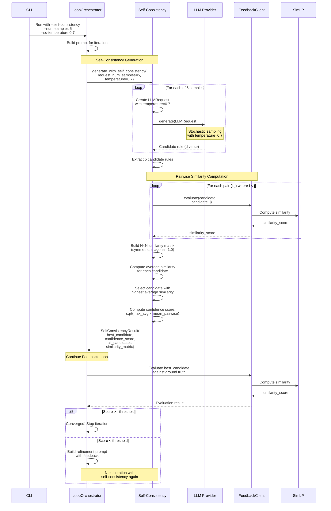

# Self-Consistency Validation

## Overview

Self-Consistency Validation is a technique that improves RTEC rule generation quality by generating multiple candidate rules and selecting the most consistent one based on pairwise similarity. This approach reduces variance in LLM outputs and helps detect specification ambiguity without requiring ground truth during generation.

### Key Benefits

- **Improved Quality**: Selects the candidate that best agrees with the ensemble of alternatives
- **Ambiguity Detection**: Low confidence scores indicate when the specification is ambiguous
- **No Ground Truth Required**: Uses pairwise similarity between candidates, not external validation
- **Seamless Integration**: Works within the existing iterative feedback loop

## How It Works

The self-consistency mechanism follows these steps:

1. **Multi-Sample Generation**: Generate N parallel candidate rules (default: 5) using the same prompt with controlled diversity (temperature > 0)
2. **Pairwise Similarity Computation**: Compute an N×N similarity matrix using SimLP to measure semantic similarity between all candidate pairs
3. **Consensus Selection**: Calculate average similarity for each candidate and select the one with highest average similarity to others
4. **Confidence Scoring**: Compute a confidence score based on agreement strength (geometric mean of max average similarity and mean pairwise similarity)
5. **Integration**: Pass only the selected candidate forward for evaluation in the feedback loop

## Architecture

### Component Flow



### Detailed Sequence Diagram



## Implementation Details

### Core Components

#### `generate_with_self_consistency()`

Main entry point for self-consistency validation. Generates N candidates, computes pairwise similarities, and selects the best candidate.

**Parameters:**
- `request: LLMRequest` - The prompt and configuration
- `llm_provider: LLMProvider` - LLM provider for generation
- `num_samples: int` - Number of candidates to generate (default: 5)
- `temperature: float` - Temperature for diversity (default: 0.7)
- `feedback_client: Optional[FeedbackClient]` - Client for similarity computation

**Returns:**
- `SelfConsistencyResult` - Contains best candidate, confidence score, and full metrics

#### `SelfConsistencyResult`

Data class containing:
- `best_candidate: str` - The selected rule
- `best_candidate_index: int` - Index of selected candidate
- `confidence_score: float` - Agreement strength (0.0-1.0)
- `all_candidates: list[str]` - All generated candidates
- `similarity_matrix: list[list[float]]` - Full N×N similarity matrix
- `average_similarities: list[float]` - Average similarity per candidate
- `is_unanimous: bool` - Whether all candidates are identical

### Selection Algorithm

1. **Generate N candidates** with temperature > 0 for diversity
2. **Compute pairwise similarities** using SimLP (N×(N-1)/2 comparisons)
3. **Calculate average similarity** for each candidate: `avg_i = sum(sim[i][j] for j≠i) / (N-1)`
4. **Select candidate** with maximum average similarity: `best = argmax(avg_i)`
5. **Compute confidence**: `confidence = sqrt(max(avg_i) × mean_pairwise)`

### Temperature Flow Fix

**Problem**: Previously, `request.temperature` was not passed to the LLM API calls, causing identical outputs.

**Solution**: Updated `LLMProvider` interface to pass `request` to `_call_provider()`, enabling providers to use `request.temperature` with fallback to `config.temperature`.

**Flow**:
```
CLI (--sc-temperature 0.7)
  → OrchestratorConfig.sc_temperature = 0.7
  → generate_with_self_consistency(temperature=0.7)
  → LLMRequest(temperature=0.7)
  → LLMProvider.generate(request)
  → _call_provider(request, final_prompt)
  → API call with temperature=0.7 ✅
```

## Configuration

### CLI Options

```bash
rtec-llm run \
  --domain msa \
  --self-consistency \
  --num-samples 5 \
  --sc-temperature 0.7
```

- `--self-consistency` / `-sc`: Enable self-consistency validation
- `--num-samples` / `-n`: Number of candidates (default: 5, range: 1-20)
- `--sc-temperature`: Temperature for diversity (default: 0.7, range: 0.0-2.0)

### Programmatic Configuration

```python
from src.core.models import OrchestratorConfig

config = OrchestratorConfig(
    use_self_consistency=True,
    sc_num_samples=5,
    sc_temperature=0.7,
)

orchestrator = LoopOrchestrator(
    prompt_builder=builder,
    llm_provider=provider,
    config=config,
)
```

## Usage Examples

### Basic Usage

```python
from src.core.self_consistency import generate_with_self_consistency
from src.interfaces.models import LLMRequest
from src.llm.factory import get_provider

# Create request
request = LLMRequest(prompt="Generate gap fluent rules")

# Get provider
provider = get_provider("openai")(config)

# Generate with self-consistency
result = generate_with_self_consistency(
    request=request,
    llm_provider=provider,
    num_samples=5,
    temperature=0.7,
)

print(f"Best candidate: {result.best_candidate}")
print(f"Confidence: {result.confidence_score:.4f}")
print(f"Unanimous: {result.is_unanimous}")
```

### Integration with Orchestrator

```python
from src.core.models import OrchestratorConfig
from src.core.orchestrator import LoopOrchestrator

config = OrchestratorConfig(
    use_self_consistency=True,
    sc_num_samples=5,
    sc_temperature=0.7,
)

orchestrator = LoopOrchestrator(
    prompt_builder=builder,
    llm_provider=provider,
    config=config,
)

result = orchestrator.run(
    fluent_name="gap",
    activity_description="A communication gap starts when...",
    ground_truth="initiatedAt(gap(Vessel)=nearPorts, T) :- ...",
)

# Access self-consistency metrics in iteration results
for iteration in result.iterations:
    if iteration.sc_confidence is not None:
        print(f"Iteration {iteration.iteration}: "
              f"confidence={iteration.sc_confidence:.4f}, "
              f"samples={iteration.sc_num_samples}")
```

## Metrics and Interpretation

### Confidence Score

The confidence score (`0.0` to `1.0`) indicates agreement strength:

- **High confidence (≥ 0.8)**: Strong agreement among candidates
- **Medium confidence (0.5-0.8)**: Moderate agreement, some variation
- **Low confidence (< 0.5)**: Weak agreement, high ambiguity

### Interpreting Results

- **High confidence + high similarity score**: Specification is clear, LLM converged well
- **High confidence + low similarity score**: LLM consistently generates incorrect rules (may need prompt refinement)
- **Low confidence**: Specification is ambiguous, multiple valid interpretations exist
- **Unanimous candidates**: All candidates identical (temperature may be too low or prompt too deterministic)

## Limitations and Considerations

1. **Computational Cost**: Requires N LLM calls + N×(N-1)/2 similarity computations per iteration
2. **No Explicit Clustering**: Current implementation uses consensus selection, not cluster-based selection
3. **Temperature Dependency**: Effectiveness depends on temperature > 0 and model's stochastic behavior
4. **Similarity Metric**: Relies on SimLP's ability to capture semantic similarity between rule variants

## Future Enhancements

Potential improvements:

1. **Explicit Clustering**: Use hierarchical clustering to identify dominant clusters
2. **Ambiguity Thresholds**: Add explicit warnings when confidence < threshold
3. **Adaptive Sampling**: Adjust temperature based on confidence from previous iterations
4. **Cluster-Based Selection**: Select from largest/most coherent cluster rather than consensus
5. **Entropy Metrics**: Add entropy-based confidence measures

## Related Documentation

- [Architecture Overview](./ARCHITECTURE.md) - System architecture
- [Setup Guide](./setup.md) - Installation and configuration
