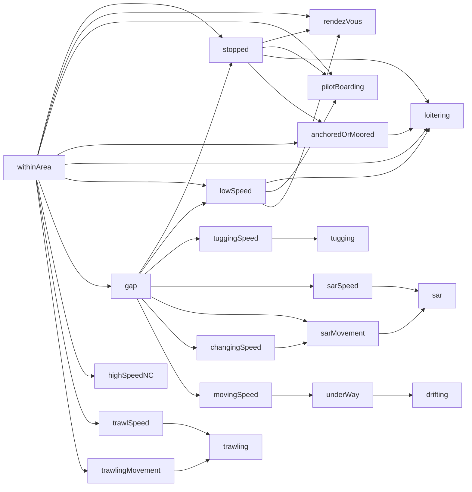

## Hierarchical Structure in RTEC Event Descriptions

Complex Event Recognition (CER) systems such as RTEC rely on hierarchically structured event descriptions—layers of fluents that depend on each other to form increasingly complex behavioural patterns. This hierarchical organisation is powerful but also introduces substantial opportunities for error, especially when rules are authored manually.

Higher-level activities frequently depend on chains of prerequisite fluents.
In domains like Maritime Situational Awareness (MSA), even a single composite activity (e.g., rendezVous, trawling, SAR) may rely on:
 - speed-related fluents
 - movement-related fluents
 - spatial fluents
 - statically determined behavioural patterns

A seemingly simple fluent—such as *withinArea*—can propagate through multiple intermediate fluents, influencing several higher-level activity definitions.

### Example: MSA Fluent Dependency Hierarchy

The diagram below illustrates a real dependency structure taken from the Maritime Situational Awareness domain. A single low-level fluent (e.g., *withinArea* or *gap*) can influence multiple layers of derived fluents:

